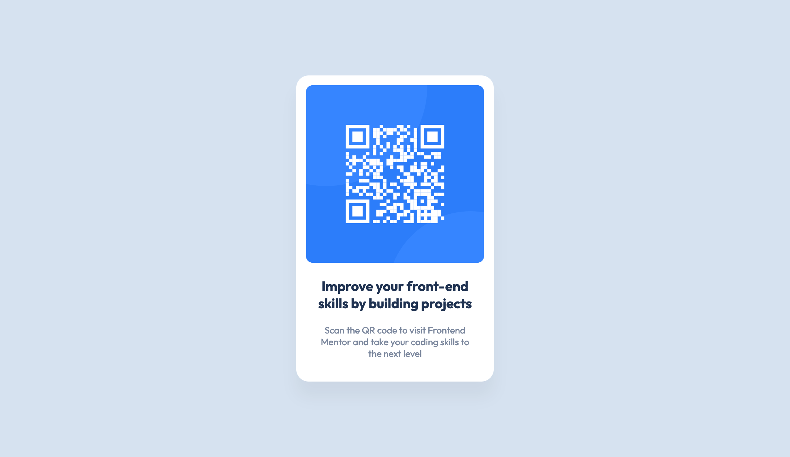

# Frontend Mentor - QR code component solution

This is a solution to the [QR code component challenge on Frontend Mentor](https://www.frontendmentor.io/challenges/qr-code-component-iux_sIO_H). Frontend Mentor challenges help you improve your coding skills by building realistic projects.

## Table of contents

- [Overview](#overview)
  - [Screenshot](#screenshot)
  - [Links](#links)
- [My process](#my-process)
  - [Built with](#built-with)
  - [What I learned](#what-i-learned)
  - [Continued development](#continued-development)
  - [Useful resources](#useful-resources)
- [Author](#author)
- [Acknowledgments](#acknowledgments)

## Overview

### Screenshot

### Links

- Solution URL: [Solution](https://www.frontendmentor.io/solutions/qr-code-component-solution-icTuJLPNx3)
- Live Site URL: [Live Site](https://lkeating26.github.io/fm-qr-code-component/)

## My process

### Built with

- Semantic HTML5 markup
- CSS custom properties
- Flexbox
- Mobile-first workflow

### What I learned

I learnt some basic css and flexbox.
I also learnt how to define custom color properties in the :root pseudo-class. This represents the root of the document which is the html element in HTML documents.
I found out how to convert a drop shadow in the figma file to css.

If in Figma the drop shadow settings are X=10, Y=20, Blur=30, and the color is rgba(0, 0, 0, 0.5), the CSS would look like this:

box-shadow: 10px 20px 30px rgba(0, 0, 0, 0.5);

I'd like to learn more about layouts using flexbox and grid.
I would also like to expand on custom properties and also

### Useful resources

- [Kevin Powell - Youtube](https://www.youtube.com/@KevinPowell) - This Youtube channel helped me all aspects of css.

## Author

- Frontend Mentor - [@lkeating26](https://www.frontendmentor.io/profile/lkeating26)

## Acknowledgments

Kevin Powell's youtube channel is such a good resource for learning all things css.
